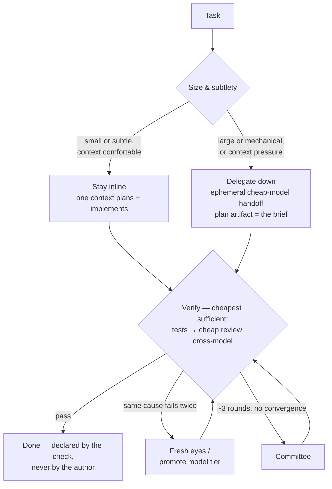

# Skills

Portable agent skills for Product Engineer. Works with Claude Code, Codex, Gemini CLI, OpenCode, and pi.

## Install

```sh
curl -fsSL https://raw.githubusercontent.com/reynldi/skills/main/install.sh | bash
```

Or from a clone: `./setup.sh`. Either way it asks where to install (global or per-project, `.claude` or `.agents`) and offers to init `.spectrum.json` — a step-by-step wizard for provider / model / effort per role (planner, implementer, reviewer, qa, …), one role at a time, continue or finish after each.

## What's inside

| Piece | Command | What it answers |
| ----- | ------- | --------------- |
| Product loop | `/product-workflow` | Is this worth building, and for whom? Discovery → validation → prioritization → PRD → metrics. Simple English, for everyone. |
| Delivery pipeline | `/development-workflow` | Can we build it, and does it work? Specs → verification → tasks → implement → review → QA, with approval gates and per-feature memory. |
| Orchestrator | `/orchestrator` | Who should do this work? Delegates via four patterns: **advisor** (second opinion), **committee** (two contrasting agents plan), **handoff** (ephemeral blocking transfer), **loop** (worker/verifier until done). |

Each stage is its own skill and also runs standalone:

- **Product** (`skills/product/`): `/product-workflow` coordinates `/product-discovery` → `/product-analysis` → `/product-validation` → `/product-prioritization` → `/product-prd` → `/product-metrics`
- **Development** (`skills/development/`): `/development-workflow` coordinates `/plan-product-spec` → `/plan-technical-spec` → `/plan-contract-spec` → `/plan-verification` → `/plan-ready` → `/plan-implement` → `/impl-review` → `/qa-test`

An APPROVED `prd.md` connects product to delivery. The orchestrator uses [Paseo](https://paseo.sh) when its daemon is running, native subagents otherwise. Every delegation is ephemeral and reports a summary: agent, role, provider/model, effort, session ID. Helpers: `workflow/orchestrator/bin/{backend,handoff,loop}.sh`.

## The principle

**One owning context, independent verification, escalate on evidence.** Judgment (plan, verify, arbitrate) stays in one frontier-model context; execution is delegated down to cheaper models only when size makes it pay; "done" is declared by a check the author didn't produce; role separation is bought reactively, never as ceremony.



Why: the handoff cost is fixed (brief + re-discovery + verification); the work's cost scales with the task. Small tasks are cheapest inline even at frontier prices. Cross-provider fresh eyes justify delegating *review*, never *implementation*.

## Layout

```
skills/product/       product loop        skills/development/   delivery pipeline
skills/general/       general skills      workflow/orchestrator global orchestrator
commands/             slash commands      setup.sh · install.sh installers
```

## Credits

The orchestrator's patterns and principles are inspired by [Paseo](https://paseo.sh) ([getpaseo/paseo](https://github.com/getpaseo/paseo)).
