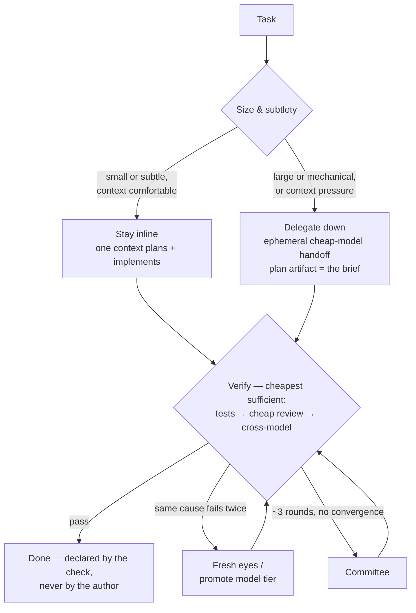

# Skills

Portable agent skills for Product Engineer. Works with Claude Code, Codex, Gemini CLI, OpenCode, and pi.

## Install

```sh
curl -fsSL https://raw.githubusercontent.com/reynldi/skills/main/install.sh | bash
```

Or from a clone: `./setup.sh`. Either way it asks where to install (global or per-project, `.claude` or `.agents`).

## Skill List

Every skill runs standalone via its slash command. The two workflow skills coordinate the others in sequence.

### Product (`skills/product/`)

| Skill | How to use | What it is |
| ----- | ---------- | ---------- |
| `/product-workflow` | "take this idea to a shipped, measured result" | Coordinates P1→P7 below. Is this worth building, and for whom? Simple English, for everyone. |
| `/product-discovery` | "learn about the users", "plan interviews" | Find which problem is worth the work — talk to real users, map problems to solutions. |
| `/product-analysis` | "research competitors", "market research" | Answer one exact question from competitor products, reviews, and win/loss evidence. Optional stage. |
| `/product-validation` | "test this idea", "design an experiment" | Find the assumption that can kill the idea and run the cheapest test that can prove it false. |
| `/product-prioritization` | "order the backlog", "make a roadmap" | Score problems and solutions with sources for each number; roadmap with no false dates. |
| `/product-prd` | "write a PRD for X" | Short PRD that starts with the problem — 5W1H, success metrics, stories, acceptance criteria. |
| `/product-prd-verification` | "verify this PRD", "the publish gate failed" | Skeptical review of one PRD — gaps, parts that do not belong, unclear words, risks; then close each gap by asking the user question by question. |
| `/product-metrics` | "set success metrics for X" | Define success in falsifiable numbers before building; record real numbers after launch. |
| `/product-publish-prd` | "publish this PRD to Confluence" | Quality-gate the session's PRD against the template, ask for space/parent with remembered defaults, add PIC mentions, publish. |

### Development (`skills/development/`)

| Skill | How to use | What it is |
| ----- | ---------- | ---------- |
| `/development-workflow` | "build this feature end-to-end" | Coordinates the pipeline below with approval gates, resume, and per-feature memory. |
| `/plan-product-spec` | "write the product spec" | Stage 1 — user-facing behavior, flows, states, edge cases. |
| `/plan-technical-spec` | "write the technical spec" | Stage 2 — architecture, models, migrations, reliability. |
| `/plan-contract-spec` | "spec the API/events" | Stage 3 — REST/gRPC/event contracts; one-paragraph file when there are none. |
| `/plan-verification` | "verify the specs" | Stage 4 — cross-spec consistency review; PASS gate before tasks. |
| `/plan-ready` | "generate implementation tasks" | Stage 5 — final gate; emits `tasks.md` and records the QA-depth choice. |
| `/plan-implement` | "implement the tasks" | Stage 6 — task-by-task build with checkpoints and regression runs. |
| `/impl-review` | "review the implementation" | Stage 7 — independent review against specs; PASS gate. |
| `/code-review` | "review this diff/branch against main" | Standalone three-axis review (Spec / Standards / Risk) via parallel subagents; not part of the pipeline. |
| `/qa-test` | "QA this feature" | Stage 8 — acceptance proof against the Product Spec; writes `qa-report.md`. |
| `/qa-planning` | "create a test plan / regression suite" | Full-QA planning: test plan, Gherkin cases, regression suite, optional dashboard. |
| `/spec-analyze` | "is this spec sound?" | Judge an existing product or technical spec against competitors, first principles, and the codebase. |
| `/spec-generate` | "spec this existing feature" | Trace a shipped feature through the code and write its spec retroactively. |
| `/task-management` | "break this plan into tickets" | Atomic, dependency-ordered tickets (tracer-bullet slices), or review tasks against specs. |
| `/retro` | "run a retro on this feature" | Post-ship retrospective — review lessons one by one and, with permission, write each into the right spec, skill, constitution, or memory file. |

### General (`skills/general/`)

| Skill | How to use | What it is |
| ----- | ---------- | ---------- |
| `/simplified-english` | "simplify this text" | Write documents in Simplified Technical English (ASD-STE100). Default output style for the product skills. |
| `/eli5` | "ELI5 this" | Explain any topic, decision, code, or process for a complete beginner. |
| `/quiz-me` | "quiz me on this" | Quiz the user on a topic — or this session's unresolved topics — at eli5, medium, or comprehensive level, with an explanation for every answer. |

An APPROVED `prd.md` connects product to delivery: `/product-workflow` ends where `/plan-product-spec` begins, in the same feature folder.

## Orchestration (optional)

Everything above runs inline in one session with no extra setup. Orchestration adds multi-model delegation on top — skip this section if you don't need it.

| Piece | Command | What it answers |
| ----- | ------- | --------------- |
| Orchestrator | `/orchestrator` | Who should do this work? Four patterns: **advisor** (second opinion), **committee** (two contrasting agents plan), **handoff** (ephemeral blocking transfer), **loop** (worker/verifier until done). |

The orchestrator uses [Paseo](https://paseo.sh) when its daemon is running, native subagents otherwise. Every delegation is ephemeral and reports a summary: agent, role, provider/model, effort, session ID. Helpers: `workflow/orchestrator/bin/{backend,handoff,loop}.sh`.

**Configuration** — `setup.sh` offers to init `.spectrum.json`, a step-by-step wizard for provider / model / effort per role (planner, implementer, reviewer, qa, …), one role at a time. Field meanings live in the development-workflow skill's "Configuration: `.spectrum.json`" section; example at `skills/development/development-workflow/templates/spectrum.json`.

**The principle** — one owning context, independent verification, escalate on evidence. Judgment (plan, verify, arbitrate) stays in one frontier-model context; execution is delegated down to cheaper models only when size makes it pay; "done" is declared by a check the author didn't produce; role separation is bought reactively, never as ceremony.



Why: the handoff cost is fixed (brief + re-discovery + verification); the work's cost scales with the task. Small tasks are cheapest inline even at frontier prices. Cross-provider fresh eyes justify delegating *review*, never *implementation*.

## Layout

```
skills/product/       product loop        skills/development/   delivery pipeline
skills/general/       general skills      workflow/orchestrator global orchestrator
commands/             slash commands      setup.sh · install.sh installers
```

## Credits

The orchestrator's patterns and principles are inspired by [Paseo](https://paseo.sh) ([getpaseo/paseo](https://github.com/getpaseo/paseo)).
