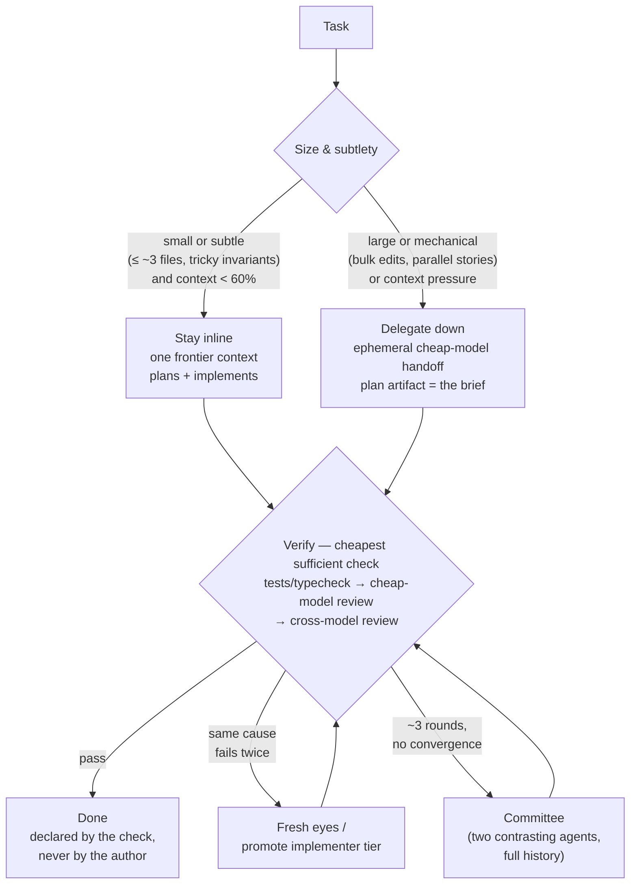

# Skills

A portable, repo-agnostic collection of agent skills. Skills are plain markdown (one folder per skill, entry point `SKILL.md`), so any coding agent that can read files can follow them — Claude Code loads them natively; Codex, Gemini CLI, OpenCode, and pi are wired via pointer blocks in their instruction files.

Two orchestrated pipelines share one initiative folder, one memory, and one config:

- **`/product-workflow`** — the product loop. It answers one question: is this worth the work, and for which users? Learn the problem → research → test the risks → select what to build → PRD → numbers → build → measure → start again.
- **`/workflow`** — the delivery pipeline. It answers a different question: can we build it, and does it work? Plan, implement, review, and test — with approval gates, memory per feature, and work for more than one model.

The connection between them: an APPROVED `prd.md` (the problem and the target result, never a feature list) goes from product to delivery.

Alongside the pipelines sits **`/orchestrator`** — a global, backend-agnostic multi-agent coordinator (advisor, committee, handoff, loop) at `workflow/orchestrator/`.

## The product loop

The product skills use Simplified Technical English (ASD-STE100). All persons can use them — engineers, marketers, and founders. No product experience is necessary. The rules are in `skills/product/product-workflow/STE.md`. The special words are in `skills/product/product-workflow/GLOSSARY.md`.

| #  | Stage | Skill / command | Document | What it does |
| -- | ----- | --------------- | -------- | ------------ |
| P1 | Learn the problem | `/product-discovery`      | discovery.md  | Interviews for stories, one page per interview, a map of problems and possible solutions |
| P2 | Research (optional) | `/product-analysis`     | analysis.md   | Competitor groups, use their product, read their reviews, won and lost deals, what comes next |
| P3 | Test the risks | `/product-validation`     | validation.md | A list of assumptions, then fake doors, click models, and manual service tests |
| P4 | Select what to build | `/product-prioritization` | priorities.md | Scores for problems or solutions, a source for each number, a Now / Next / Later roadmap |
| P5 | Write the PRD | `/product-prd`            | prd.md        | Introduction with 5W1H, success numbers, user stories, requirements with acceptance criteria, detail per function |
| P6 | Set the numbers | `/product-metrics`        | metrics.md    | One main number, weekly numbers, one early signal, and the things that must not become worse |

Price, market size, sales plans, and unit economics are out of scope.

## The delivery pipeline

| # | Phase     | Skill / command       | Artifact                 | Gate                            |
| - | --------- | --------------------- | ------------------------ | ------------------------------- |
| 0 | Discover  | (workflow, inline)    | memory.md                | —                               |
| 1 | Planning  | `/plan-product-spec`  | product-spec.md          | user approval                   |
| 2 | Planning  | `/plan-technical-spec`| technical-spec.md        | user approval                   |
| 3 | Planning  | `/plan-contract-spec` | contract-spec.md         | user approval                   |
| 4 | Planning  | `/plan-verification`  | verification.md          | PASS or PASS_WITH_NOTES, no open Blocking/High |
| 5 | Planning  | `/plan-ready`         | tasks.md                 | PASS + user approval            |
| 6 | Implement | `/plan-implement`     | implementation-report.md | all tasks PASS, regression green, git clean |
| 7 | Review    | `/impl-review`        | review-report.md         | PASS, no open Blocking/High     |
| 8 | QA        | `/qa-test`            | qa-report.md             | PASS + user sign-off            |

`/workflow` orchestrates all of it: run `/workflow <feature idea>` for a full run, or any stage standalone. All artifacts live in one feature folder (discovered from the project's spec convention; fallback `specs/{feature-name}/`), each ending in a machine-readable Status line — resume works from disk alone, no chat history needed.

## Install

One-liner (no clone needed; defaults to `--global`, all agents):

```sh
curl -fsSL https://raw.githubusercontent.com/reynldi/skills/main/install.sh | bash
curl -fsSL https://raw.githubusercontent.com/reynldi/skills/main/install.sh | bash -s -- --agents claude,codex
curl -fsSL https://raw.githubusercontent.com/reynldi/skills/main/install.sh | bash -s -- --project ~/code/myrepo
```

From a clone:

```sh
./setup.sh --global                          # all agents, user-wide
./setup.sh --project ~/code/myrepo           # all agents, one repo
./setup.sh --global --agents claude,codex    # subset
```

| Agent    | Skills (copied)                     | Wiring                                          |
| -------- | ----------------------------------- | ----------------------------------------------- |
| claude   | `~/.claude/skills` or `<dir>/.claude/skills` | slash commands into `commands/` (native)  |
| codex    | same copy                           | pointer block in `~/.codex/AGENTS.md` / `<dir>/AGENTS.md` |
| gemini   | same copy                           | pointer block in `~/.gemini/GEMINI.md` / `<dir>/GEMINI.md` |
| opencode | same copy                           | pointer block in `~/.config/opencode/AGENTS.md` / `<dir>/AGENTS.md` |
| pi       | same copy                           | pointer block in `<dir>/AGENTS.md` (project only) |

Pointer blocks are marker-delimited and idempotent — re-run `setup.sh` after updating skills.

After wiring, `setup.sh` offers to init **`.spectrum.json`** with a step-by-step wizard: pick the workflow roles to configure (planner, implementer, reviewer, qa, researcher, coordinator), set provider / model / effort per role (effort defaults to medium; planner and reviewer to high), then the remaining settings (context-rotation %, specs root, yolo). It prompts on your terminal even under `curl | bash`, keeps an existing file unless you confirm overwrite, and skips itself when headless — `--spectrum` forces it, `--no-spectrum` suppresses it. Project installs write to the project root; global installs write to the current directory.

## Configuration: `.spectrum.json`

One optional project-root file configures both pipelines (example: `skills/development/workflow/templates/spectrum.json`; semantics: the workflow skill's Configuration section):

- **Roles & stages** — model, provider, effort, and inline-vs-delegate per role (`coordinator`, `planner`, `implementer`, `reviewer`, `qa`, `researcher`); `stages` maps every pipeline stage to a role.
- **Reuse** — `policy`, `rotateAtContextPct` (default 75), `alwaysFresh` roles (reviewer/qa keep fresh eyes).
- **Memory** — feature memory filename, handoff dir, optional cross-feature `globalMemory` path.
- **Artifacts / delegation** — specs root override; `yolo` for isolated worktrees.

The coordinator resolves the config itself — no scripts parse it; user instructions always win over the file.

## Multi-model delegation

The workflow coordinator can hand any stage to another model with a fresh process and zero shared context:

```sh
skills/development/workflow/bin/agent.sh list                       # show installed providers
skills/development/workflow/bin/agent.sh codex/gpt-5.1-codex \
    specs/my-feature/handoff/001-impl-review-codex.md               # run one delegation
```

- **Handoff briefs** (`workflow/templates/handoff.md`): self-contained — mission with scope directives, process pointer, read-first list, decisions made, tried-and-failed, constraints, definition of done, report-back format. Pointers to files, never pasted content.
- **Memory** (`workflow/templates/memory.md`): per-feature append-only log — project facts, decisions + why, failed attempts, delegation log. Every agent (any model) reads and appends it.
- **Trust nothing**: the coordinator verifies the artifact, gate, and diff before accepting a delegate's work. Full run logs land beside each brief.
- **Reuse agents**: iterating on the same stage continues the same agent — `AGENT_RESUME=1 agent.sh …` resumes the provider's last session (claude/codex/opencode/pi). Spawn fresh only at ~75% context use, on a stage change, or when fresh eyes are the point.
- Guarded defaults (sandbox / edit-only approval); `AGENT_YOLO=1` removes guardrails — only inside an isolated worktree or container.

## The orchestrator

`/orchestrator` (root-level `workflow/orchestrator/`) delegates work to other agents with the right pattern:

| Pattern | Use when | Playbook |
| ------- | -------- | -------- |
| Advisor   | You want an outside judgment but keep driving the work | `patterns/advisor.md` |
| Committee | Stuck, looping, or facing a hard planning problem — two contrasting high-reasoning agents plan in parallel | `patterns/committee.md` |
| Handoff   | The work moves to another agent entirely — ephemeral, blocking, reports back | `patterns/handoff.md` |
| Loop      | Retry-until-verified with an objective done-condition ("babysit this PR", "tests to green") | `patterns/loop.md` |

Backend-agnostic: it uses [Paseo](https://paseo.sh) when its daemon is running, native subagents otherwise, and degrades to an inline fallback (never faking a second agent). Delegates are **ephemeral**: launched blocking, they report and are torn down — no agent outlives its task — and every delegation emits a summary (agent name, role, provider/model, effort, session ID, status) to the console and `<brief>.summary.json`.

Deterministic helpers in `workflow/orchestrator/bin/`:

```sh
bin/backend.sh                                        # resolve backend + role→provider map
bin/handoff.sh --brief handoff.md --provider codex \
               --role delegate --effort high          # one ephemeral blocking delegation
bin/loop.sh --worker claude --worker-prompt w.md \
            --verify-check "npm test" --max-iterations 10   # bounded worker/verifier loop
```

`loop.sh` mirrors Paseo's LoopService guarantees: verification and bounds are mandatory, every iteration logged to disk. When Paseo is available, prefer `paseo loop run`.

## The delegation principle

**One owning context, independent verification, escalate on evidence.** Judgment (plan, verify, arbitrate) stays in one frontier-model context from start to finish; execution is delegated down to ephemeral cheaper models only when size makes it pay; "done" is always declared by a check the author didn't produce; and separation of roles is bought reactively — when a failure signal demands it — never as up-front ceremony.



Why this shape: the handoff cost is roughly **fixed** (brief + delegate re-discovery + verification) while the work's cost **scales with the task** — so small tasks are cheapest inline even at frontier prices, and only large or mechanical work earns its delegation. Cross-provider fresh eyes justify delegating *review*, never *implementation*. The rule is codified in the orchestrator's "Delegate or stay inline" section and the workflow skill's sizing rule.

## Principles

- Product Spec defines behavior; project conventions define implementation style; specs are the source of truth during implementation.
- Repo-agnostic: discovering the project (stack, commands, conventions, spec layout) is part of every skill — nothing is hardcoded.
- File-based state over hidden state; everything observable (briefs, logs, artifacts on disk).
- Challenge complexity: current requirements beat hypothetical future needs; prefer extending existing patterns over new abstractions.
- Every gate is real: no tasks while Blocking/High findings are open, no dependent task before reviewer PASS, no continuing past a dirty checkpoint.

## Layout

```
skills/
  development/    delivery pipeline (plan-*, impl-review, qa-test, workflow) + others
  product/        product loop (product-discovery … product-workflow)
  general/        general skills
workflow/
  orchestrator/   global multi-agent orchestrator (patterns/ + bin/)
commands/         Claude Code slash commands (thin pointers to skills)
setup.sh          multi-agent installer (global or per-project)
install.sh        curl one-liner bootstrap (fetches the repo, runs setup.sh)
```

Each skill keeps its output templates in `templates/` (read only at write time — keeps every invocation cheap); the workflow skill also ships `bin/agent.sh`.

## Credits

The orchestrator's patterns and principles — advisor, committee, handoff, and loop; self-contained zero-context briefings, deliberate provider contrast, no-edits analysis agents, trust-the-wait, and hard bounds on loops — are inspired by [Paseo](https://paseo.sh) ([getpaseo/paseo](https://github.com/getpaseo/paseo)) and its orchestration skills.
