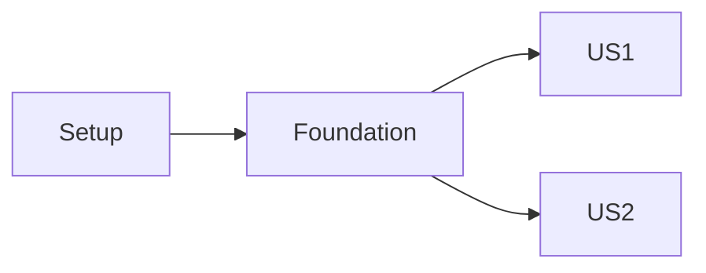

# {Feature Name} - Implementation Tasks

**Lifecycle**: ACTIVE
**Owner**: {owner}
**Next consumer**: {stage / person}
**Review trigger**: {scope, dependency, or verification change}

## Readiness

**Status**: PASS <!-- PASS | FAIL — on FAIL, list issues below and generate no tasks -->

- Product Spec: PASS / FAIL
- Technical Spec: PASS / FAIL
- Contract Spec: PASS / FAIL / N/A
- Cross-Spec: PASS / FAIL
- Open Blocking/High: None / {severity · affected spec · recommendation · owning stage}

**User approval**: pending <!-- pending | approved — /plan-implement requires approved -->
**Baseline**: — <!-- {sha} — set by /plan-implement at preflight -->
**QA depth**: Focused <!-- Focused | Feature | Full — Full requires /qa-planning before /qa-test -->

## Phase 1: Setup (shared infrastructure — skip when unnecessary)

- [ ] T001 {action} in `{path}`
  - Acceptance: {observable criteria}

**Checkpoint**: Setup ready

## Phase 2: Foundational (blocking prerequisites only — keep minimal)

No story work begins until this phase completes.

- [ ] T002 [P] {action} in `{path}`
  - Acceptance: {criteria}

**Checkpoint**: Foundation ready

<!-- Repeat the phase below once per user story, ordered by priority. -->

## Phase 3: User Story 1 - {Title} (Priority: P1, MVP)

**Goal**: {user outcome}
**Independent Test**: {how to verify this story alone}

### Tests

- [ ] T003 [P] [US1] {test task — test-first: confirm FAIL before implementing}
  - Acceptance: {criteria}

### Implementation

- [ ] T004 [US1] {action} in `{path}`
  - Acceptance: {criteria}

### Review

- [ ] T005 [US1] Story review by an independent reviewer
  - Acceptance: story acceptance criteria + Product/Technical/Contract compliance + tests + project conventions all PASS.

**Checkpoint**: US1 independently functional and reviewed

## Phase N: Polish (only real cross-cutting work)

- [ ] T0XX {documentation / cleanup / regression / observability / hardening}
  - Acceptance: {criteria}

## Dependencies & Execution Order

- Setup → Foundation → user stories (priority order) → Polish
- US1 → independent; US2 → depends on {X}; {stories} can run in parallel after Foundation

## Checkpoint Plan

| Checkpoint | Trigger        | Tasks     |
| ---------- | -------------- | --------- |
| CP1        | {cadence rule} | T001-T005 |

Gate protocol (review, regression, retrospective, git) is defined by /plan-implement.
